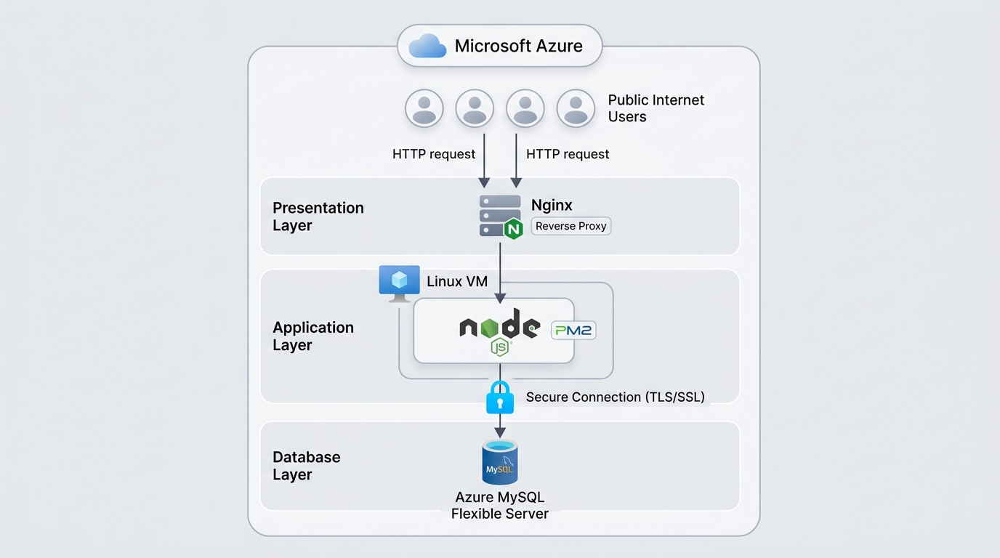
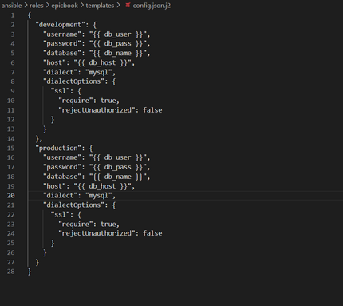

# 📚 EpicBook — Production-Grade 3-Tier Deployment on Azure


---

## 🚀 Overview

This project deploys a **production-style 3-tier application** on Azure using:

* **Terraform** → Infrastructure provisioning
* **Ansible** → Configuration & deployment
* **Nginx** → Reverse proxy
* **Node.js (PM2)** → Application runtime
* **Azure MySQL** → Managed database

Everything is automated end-to-end. No manual configuration.

---

## 🏗️ Architecture




```text
Client → Nginx → Node.js → Azure MySQL
```

---

## 📂 Project Structure

```bash
epicbook-prod/
├── README.md
├── ansible/
│   ├── inventory.ini
│   ├── site.yml
│   ├── group_vars/
│   │   └── web.yml (encrypted)
│   └── roles/
│       ├── common/
│       ├── nginx/
│       └── epicbook/
│
└── terraform/
    └── azure/
        ├── main.tf
        ├── variables.tf
        ├── terraform.tfvars
        ├── output.tf
        └── terraform.tfstate
```

---

## ⚙️ Local Setup (WSL Ubuntu on Windows)

This project was built using:

* Windows + WSL (Ubuntu)
* Python virtual environment
* All tools installed inside WSL

---

### 🧰 Install Azure CLI

```bash
curl -sL https://aka.ms/InstallAzureCLIDeb | sudo bash
az login
```

---

### 🏗️ Install Terraform

```bash
sudo apt update && sudo apt install -y gnupg software-properties-common

wget -O- https://apt.releases.hashicorp.com/gpg | gpg --dearmor | \
sudo tee /usr/share/keyrings/hashicorp-archive-keyring.gpg

echo "deb [signed-by=/usr/share/keyrings/hashicorp-archive-keyring.gpg] \
https://apt.releases.hashicorp.com $(lsb_release -cs) main" | \
sudo tee /etc/apt/sources.list.d/hashicorp.list

sudo apt update && sudo apt install terraform
```

---

### ⚙️ Install Ansible (Python Virtual Environment)

```bash
sudo apt install python3-venv -y

python3 -m venv venv
source venv/bin/activate

pip install ansible
```

---

## 🔐 Secrets Management (Ansible Vault)

Sensitive configuration is encrypted:

```bash
ansible/group_vars/web.yml
```

Protected using:

```bash
ansible-vault encrypt group_vars/web.yml
```

Run playbook securely:

```bash
ansible-playbook -i inventory.ini site.yml --vault-password-file .vault_pass


```

✔ No plain-text secrets
✔ Safe for GitHub
✔ Industry-standard practice

---

## 🚀 Deployment

### 1. Provision Infrastructure

```bash
cd terraform/azure
terraform init
terraform apply -auto-approve
```


```

---

### 2. Configure SSH

```bash
Host epicbook
    HostName <PUBLIC_IP>
    User azureuser
    IdentityFile ~/.ssh/azure_rsa
```

---

### 3. Deploy Application

```bash
ansible-playbook -i inventory.ini site.yml --vault-password-file .vault_pass
```


```

---

## ⚠️ Real Issue & Fix — Azure MySQL SSL

### Problem

Azure MySQL **rejects non-SSL connections**.

Error:

```bash
SSL connection is required. Please specify SSL options and retry.
```

---

### Fix

Updated Ansible template:

```bash
ansible/roles/epicbook/templates/config.json.j2
```

```json
"dialectOptions": {
  "ssl": {
    "require": true,
    "rejectUnauthorized": false
  }
}
```


```

---

### Why It Works

* Forces encrypted connection
* Matches Azure security requirements

---

### Production Note

In stricter setups:

* Use CA certificate
* Enable full validation (`rejectUnauthorized: true`)

---

## 📸 Proof of Deployment

### Application

```


```


---
```

### PM2 Monitoring


---

### Terraform Output


---

### Ansible Execution


---

## ✅ Verification

```bash
ssh epicbook "pm2 list"
curl -I http://epicbook
ssh epicbook "pm2 logs"
```

---

## ⚠️ Troubleshooting

| Issue               | Fix               |
| ------------------- | ----------------- |
| App not running     | `pm2 restart all` |
| Config drift        | Re-run Ansible    |
| Infra issue         | Re-run Terraform  |
| DB connection fails | Check SSL config  |

---

## 🧠 Lessons Learned

* Cloud services enforce security by default
* Always expect SSL/TLS requirements
* Separate infra from configuration
* Automate everything — manual steps break systems

---

## 🎯 What This Project Demonstrates

* Real-world DevOps workflow
* Infrastructure as Code
* Secure secret management
* Debugging production issues
* System design thinking

---

## 👤 Author

**Miracle Orji**
Cloud & Cybersecurity Engineer

---

## ⭐ Final Notes

* Add real screenshots in `/docs`
* Never commit `.vault_pass`
* Pin this repo on your GitHub

---

## 🔥 Bottom Line

This is not a tutorial project.

This is how real systems are:

* built
* secured
* debugged
* and maintained

---


